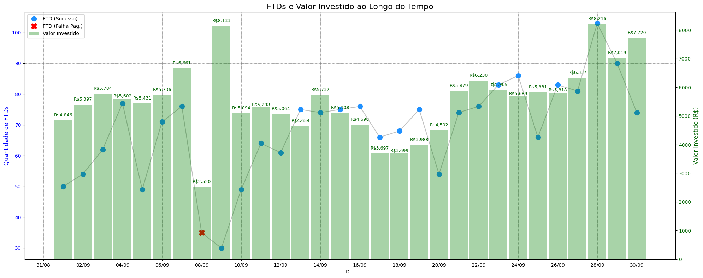

# 📊 Gerador de Gráfico - FTDs & Investimento

**[Acessar o Aplicativo Web](https://graficos-cds.streamlit.app/)**

## Sobre o Projeto

Este projeto é um aplicativo web desenvolvido em Streamlit para automatizar a criação de gráficos de acompanhamento de métricas de FTDs (First Time Deposit) e Valor Investido.

Criado para otimizar processos internos, ele permite que qualquer membro da equipe gere visualizações atualizadas de forma rápida, apenas fazendo o upload de um arquivo Excel.

## Como Funciona

O processo para gerar um gráfico é muito simples:

1.  **Baixe o arquivo de exemplo:** O app fornece um template `.xlsx` para garantir que os dados estejam no formato correto.
2.  **Preencha com seus dados:** Adicione as informações diárias nas colunas correspondentes (`Dia`, `FTDs`, `Valor investido`, `Falha Pag`).
3.  **Arraste e Solte:** Faça o upload do arquivo preenchido na interface do aplicativo.
4.  **Finalizado.** O gráfico e as métricas principais são gerados e exibidos na tela instantaneamente.

## Exemplo do Resultado

## Tecnologias Utilizadas

-   **Streamlit:** Para a criação da interface web.
-   **Pandas:** Para a manipulação e cálculo dos dados.
-   **Matplotlib:** Para a geração e customização dos gráficos.
